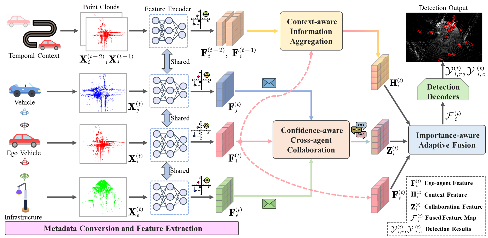

# Spatio-Temporal Domain Awareness for Multi-Agent Collaborative Perception

> [**Spatio-Temporal Domain Awareness for Multi-Agent Collaborative Perception**](https://arxiv.org/pdf/2307.13929.pdf),            
> Kun Yang\*, Dingkang Yang\*, Jingyu Zhang, Mingcheng Li, Yang Liu, Jing Liu, Hanqi Wang, Peng Sun, Liang Song  
> *Accepted by ICCV 2023*

## Abstract

Multi-agent collaborative perception as a potential application for vehicle-to-everything communication could significantly improve the perception performance of autonomous vehicles over single-agent perception. However, several challenges remain in achieving pragmatic information sharing in this emerging research. In this paper, we propose SCOPE, a novel collaborative perception framework that aggregates the spatio-temporal awareness characteristics across on-road agents in an end-to-end manner. Specifically, SCOPE has three distinct strengths: i) it considers effective semantic cues of the temporal context to enhance current representations of the target agent; ii) it aggregates perceptually critical spatial information from heterogeneous agents and overcomes localization errors via multi-scale feature interactions; iii) it integrates multi-source representations of the target agent based on their complementary contributions by an adaptive fusion paradigm. To thoroughly evaluate SCOPE, we consider both real-world and simulated scenarios of collaborative 3D object detection tasks on three datasets. Extensive experiments demonstrate the superiority of our approach and the necessity of the proposed components.
