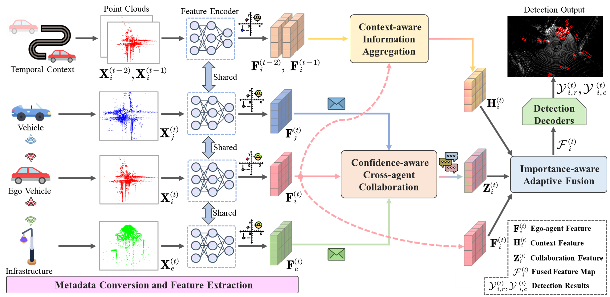

# SCOPE
The official implementation of ICCV2023 paper "Spatio-Temporal Domain Awareness for Multi-Agent Collaborative Perception".



> [**Spatio-Temporal Domain Awareness for Multi-Agent Collaborative Perception**](https://arxiv.org/pdf/2307.13929.pdf),            
> Kun Yang\*, Dingkang Yang\*, Jingyu Zhang, Mingcheng Li, Yang Liu, Jing Liu, Hanqi Wang, Peng Sun, Liang Song <br>
> *Accepted by ICCV 2023*

## Abstract

Multi-agent collaborative perception as a potential application for vehicle-to-everything communication could significantly improve the perception performance of autonomous vehicles over single-agent perception. However, several challenges remain in achieving pragmatic information sharing in this emerging research. In this paper, we propose SCOPE, a novel collaborative perception framework that aggregates the spatio-temporal awareness characteristics across on-road agents in an end-to-end manner. Specifically, SCOPE has three distinct strengths: i) it considers effective semantic cues of the temporal context to enhance current representations of the target agent; ii) it aggregates perceptually critical spatial information from heterogeneous agents and overcomes localization errors via multi-scale feature interactions; iii) it integrates multi-source representations of the target agent based on their complementary contributions by an adaptive fusion paradigm. To thoroughly evaluate SCOPE, we consider both real-world and simulated scenarios of collaborative 3D object detection tasks on three datasets. Extensive experiments demonstrate the superiority of our approach and the necessity of the proposed components.

## Installation
Please refer to [OpenCOOD](https://opencood.readthedocs.io/en/latest/md_files/installation.html) and [centerformer](https://github.com/TuSimple/centerformer/blob/master/docs/INSTALL.md) for more installation details.

Here we install the environment based on the OpenCOOD and centerformer repos.

```bash
# Clone the OpenCOOD repo
git clone https://github.com/DerrickXuNu/OpenCOOD.git
cd OpenCOOD

# Create a conda environment
conda env create -f environment.yml
conda activate opencood

# install pytorch
conda install -y pytorch torchvision cudatoolkit=11.3 -c pytorch

# install spconv 
pip install spconv-cu113

# install basic library of deformable attention
git clone https://github.com/TuSimple/centerformer.git
cd centerformer

# install requirements
pip install -r requirements.txt
sh setup.sh

# clone our repo
https://github.com/starfdu1418/SCOPE.git

# install v2xvit into the conda environment
python setup.py develop
python opencood/utils/setup.py build_ext --inplace
```

## Data
Please download the [V2XSet](https://drive.google.com/drive/folders/1r5sPiBEvo8Xby-nMaWUTnJIPK6WhY1B6) and [OPV2V](https://drive.google.com/drive/folders/1dkDeHlwOVbmgXcDazZvO6TFEZ6V_7WUu) datasets. The dataset folder should be structured as follows:
```sh
v2xset # the downloaded v2xset data
  ── train
  ── validate
  ── test
opv2v # the downloaded opv2v data
  ── train
  ── validate
  ── test
```

## Getting Started
### Test with pretrained model
We provide our pretrained models on V2XSet and OPV2V datasets. The download urls are as follows:

[V2XSet-Baidu Disk](https://pan.baidu.com/s/1N2IT8Pp11_hYai-EvY9Rjg?pwd=ztcw) \
[V2XSet-Google Drive](https://drive.google.com/drive/folders/1P2dBEh9v5r1Y7008bXbNMOK9FB-_uWmd?usp=sharing) \
[OPV2V-Baidu Disk](https://pan.baidu.com/s/13xDCs2bn-6FKoLdDgDj2Bw?pwd=v6zh)\
[OPV2V-Google Drive](https://drive.google.com/drive/folders/1ezHtKYKD8a1os0HhPkRKkdeoxCjpeNf_?usp=sharing)

To test the provided pretrained models of SCOPE, please download the model file and put it under v2xvit/logs/scope. The `validate_path` in the corresponding `config.yaml` file should be changed as `v2xset/test` or `opv2v/test`. 

To test under the default pose error setting in our paper, please change the `loc_err` in the corresponding `config.yaml` file as `True`. The default localization and heading errors are set as 0.2m and 0.2&deg; in the `inference.py`.

Run the following command to conduct test:
```sh
python v2xvit/tools/inference.py --model_dir ${CHECKPOINT_FOLDER} --eval_epoch ${EVAL_EPOCH}
```
The explanation of the optional arguments are as follows:
- `model_dir`: the path to your saved model.
- `eval_epoch`: the evaluated epoch number.

You can use the following commands to test the provided pretrained models:
```sh
V2XSet dataset: python v2xvit/tools/inference.py --model_dir ${CHECKPOINT_FOLDER} --eval_epoch 31
OPV2V dataset: python v2xvit/tools/inference.py --model_dir ${CHECKPOINT_FOLDER} --eval_epoch 34
```

### Train your model
We follow OpenCOOD to use yaml files to configure the training parameters. You can use the following command to train your own model from scratch or a continued checkpoint:
```sh
python v2xvit/tools/train.py --hypes_yaml ${CONFIG_FILE} [--model_dir  ${CHECKPOINT_FOLDER}]
```
The explanation of the optional arguments are as follows:
- `hypes_yaml`: the path of the training configuration file, e.g. `v2xvit/hypes_yaml/point_pillar_scope.yaml`. You can change the configuration parameters in this provided yaml file.
- `model_dir` (optional) : the path of the checkpoints. This is used to fine-tune the trained models. When the `model_dir` is
given, the trainer will discard the `hypes_yaml` and load the `config.yaml` in the checkpoint folder.

## Citation
 If you are using our SCOPE for your research, please cite the following paper:
 ```bibtex
@inproceedings{yang2023spatio,
  title={Spatio-Temporal Domain Awareness for Multi-Agent Collaborative Perception},
  author={Yang, Kun and Yang, Dingkang and Zhang, Jingyu and Li, Mingcheng and Liu, Yang and Liu, Jing and Wang, Hanqi and Sun, Peng and Song, Liang},
  booktitle={International Conference on Computer Vision (ICCV 2023)},
  year={2023}
}
```

## Acknowledgement
Many thanks to Runsheng Xu for the high-quality dataset and codebase, including [V2XSet](https://drive.google.com/drive/folders/1r5sPiBEvo8Xby-nMaWUTnJIPK6WhY1B6), [OPV2V](https://drive.google.com/drive/folders/1dkDeHlwOVbmgXcDazZvO6TFEZ6V_7WUu), [OpenCOOD](https://github.com/DerrickXuNu/OpenCOOD) and [OpenCDA](https://github.com/ucla-mobility/OpenCDA). The same goes for [Where2comm](https://github.com/MediaBrain-SJTU/Where2comm.git) and [centerformer](https://github.com/TuSimple/centerformer.git) for the excellent codebase.